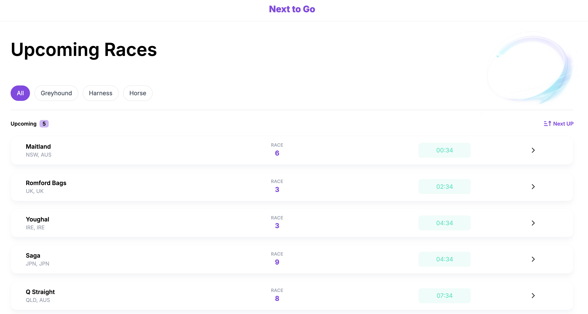

# Next to go Races

A single page application that displays upcoming races in real time using the Next to Go API.

## Preview



## Features
- Displays the next available races
- Shows up to 5 races sorted by advertised start time
- Removes races 60 seconds after the race has started
- Category filtering( All, Greyhound, Harness, Horse )
- Real-time countdown updates
- Basic accessibility support

## Tech Stack
- Vue 3
- Vite
- TypeScript
- Pinia
- Tailwind CSS
- Vitest

## Getting Started

### Installation
```bash
npm install

npm run dev
npm run test
```

## Project Structure
```bash
src/
  components/
  composable/
  services/
  stores/
  types/
  utils/
```

## Approach

Race data is fetched from the API and stored globally using Pinia.

The filtered race list is derived through composables and computed properties to keep UI logic reusable and maintainable.

Pure functions such as sorting and time formatting were moved into utility functions.

Tailwind CSS was used for styling with centralized brand color variables for consistent design management.

---

## State Management and Data Flow

The application uses Pinia through `useRaceStore` to manage shared race-related state.

The store is responsible for:

- fetching race data from the API
- storing the raw race list
- storing the selected category ID
- managing loading and error states

This keeps API data and global UI state in one predictable place.

### Data Flow

1. `RaceList` calls `raceStore.fetchRaces()` when the component is mounted
2. `fetchRaces()` requests data from the API service
3. API response data is mapped from `next_to_go_ids` and `race_summaries`
4. The mapped race list is saved into `raceStore.races`
5. `useFilteredRaces` reads `raceStore.races` and `selectedCategoryId`
6. The visible list is filtered, sorted, expired races are removed, and the result is limited to 5 races
7. `RaceList` renders the final visible races using `RaceCard`


---

### `useCurrentTime`

`useCurrentTime` creates a reactive timestamp that updates every second.

The interval is cleaned up when the component is unmounted to avoid unnecessary background timers.

### `useFilteredRaces`

`useFilteredRaces` creates the final race list shown in the UI.

It combines:

- selected category filtering
- removing races that started more than 60 seconds ago
- sorting races by advertised start time
- limiting the visible results to 5 races
- `computed` properties minimise unnecessary recalculations during reactive updates

## Edge Cases Handled

- Displays `LIVE` when the race start time has passed
- Removes races 60 seconds after the race has started
- Updates countdown values in real time

---

## Testing

- Countdown time formatting
- Race start time sorting


